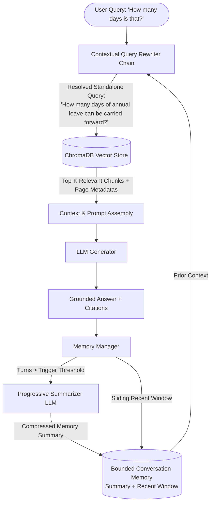

# Conversational RAG: Multi-Turn Contextual Retrieval & Bounded Memory

A production-quality **Conversational Retrieval-Augmented Generation (RAG)** application engineered with **FastAPI**, **LangChain**, **ChromaDB**, **OpenAI API**, and a modern **React + Vite + Tailwind CSS** developer dashboard.

Unlike naive single-shot RAG systems that execute literal semantic search on every user prompt, this system features a **contextual query-rewriting pipeline** and **bounded, self-summarizing conversation memory**.

---

## 💡 The Core Problem: Why Conversational RAG is Different

In standard RAG:
1. User: *"What is the employee annual leave entitlement?"* → RAG retrieves policy chunks and answers: *"Employees get 20 days per year."*
2. User: *"Can it be carried forward to next year?"* → Naive RAG searches for *"Can it be carried forward to next year?"*. Because "it" has no semantic meaning in the vector space, vector retrieval retrieves irrelevant chunks.
3. User: *"How many days is that?"* → Naive RAG searches for *"How many days is that?"* and fails completely.

### The Solution: Contextual Query Rewriting Pipeline



---

## 🏛️ Architecture & Key Components

### 1. Contextual Query Rewriter
- Inspects the **bounded conversation summary**, **recent message history**, and the **latest user query**.
- Resolves pronouns (*"it"*, *"that"*, *"those"*, *"they"*) and elliptical follow-ups (*"how many days?"*, *"what about international customers?"*) into self-contained standalone search queries.
- If the question is already complete and standalone, its original meaning is strictly preserved.

### 2. Bounded & Self-Summarizing Memory
- Standard chat histories grow unbounded, leading to massive token costs, latency, and context window overflow.
- **Bounded Sliding Window**: Retains only the most recent $N$ conversational turns (`MAX_RECENT_MESSAGES`).
- **Progressive Background Summarizer**: When turns cross `SUMMARY_TRIGGER`, older messages are compressed into a concise domain summary that preserves all critical entities, numbers, dates, policies, and names.

### 3. Document Ingestion Pipeline
- Supports **PDF** (page-by-page extraction with page metadata), **DOCX**, **TXT**, and **Markdown**.
- Recursive chunking with configurable `CHUNK_SIZE` (default: 1000) and `CHUNK_OVERLAP` (default: 150).
- Strict metadata preservation on every chunk: `document_id`, `filename`, `file_type`, `page`, `chunk_id`, `chunk_index`, `total_chunks`.

### 4. Vector Store & Retrieval Abstraction
- Persistent local **ChromaDB** with cosine similarity metrics.
- Clean vector retriever abstraction layer with configurable `top_k`, similarity thresholding, and per-document deletion.
- Deterministic fallback embedding adapter for offline testing.

### 5. Grounded Generation & Citations
- System prompt instructs LLM to answer strictly from retrieved chunks.
- If context is absent, responds: *"I couldn't find that information in the uploaded documents."*
- Attaches structured citations with document filenames, page numbers, similarity scores, and text snippets.

### 6. RAG Transparency Panel
- Expandable interactive accordion under each assistant response displaying:
  - ⚡ **Original User Query** vs. 🔄 **Contextually Rewritten Retrieval Query**
  - 🔍 **Retrieved Chunks** with similarity match percentage & page references
  - 🧠 **Active Memory State** (compressed summary + sliding window turn count)

---

## 🚀 Quickstart

### Prerequisites
- Python 3.11+ / 3.12+ / 3.14+
- Node.js 18+ & npm

### 1. Clone & Configure Environment

```bash
cd "d:/GitProjects/Conversational Rag"

# Copy example environment file
cp backend/.env.example backend/.env
```

Edit `backend/.env` to configure your OpenAI API key and hyperparameters:
```env
OPENAI_API_KEY=sk-your-openai-api-key
OPENAI_MODEL=gpt-4o-mini
EMBEDDING_MODEL=text-embedding-3-small
CHROMA_PERSIST_DIRECTORY=./chroma_db
CHUNK_SIZE=1000
CHUNK_OVERLAP=150
TOP_K=4
MAX_RECENT_MESSAGES=6
SUMMARY_TRIGGER=6
```

---

### 2. Backend Setup & Run

```bash
# Create and activate virtual environment
python -m venv .venv
# On Windows PowerShell:
.\.venv\Scripts\Activate.ps1
# On macOS/Linux:
# source .venv/bin/activate

# Install dependencies
pip install -r backend/requirements.txt

# Start FastAPI backend server (Runs on port 8000)
python -m uvicorn app.main:app --app-dir backend --reload --port 8000
```

The API will be live at `http://localhost:8000` with interactive Swagger docs at `http://localhost:8000/docs`.

---

### 3. Frontend Setup & Run

In a separate terminal:

```bash
cd frontend

# Install npm dependencies
npm install

# Start Vite development server (Runs on port 5173)
npm run dev
```

Open your browser at `http://localhost:5173`.

---

## 🐳 Docker Support

Run the complete fullstack application with Docker Compose:

```bash
docker-compose up --build
```

---

## 🧪 Running Automated Tests

Run the comprehensive pytest suite covering ingestion, ChromaDB vector store, memory bounds, query rewriting, and API endpoints:

```bash
.\.venv\Scripts\python.exe -m pytest tests/ -v
```

### Test Suite Summary:
- `tests/test_ingestion.py`: Document parsing (PDF, TXT, DOCX, MD), text cleaner, chunk metadata.
- `tests/test_retrieval.py`: Chroma vector persistence, similarity search, top-k, deletion, citations.
- `tests/test_query_rewriting.py`: Context-dependent follow-up rewriting, standalone query preservation.
- `tests/test_memory.py`: Bounded sliding window, summarization threshold triggering, session lifecycle.
- `tests/test_api.py`: FastAPI endpoints (`/api/documents/upload`, `/api/chat`, `/api/conversations`, `/api/health`).

---

## 📡 API Reference

### 1. Document Management
- `POST /api/documents/upload`: Upload and index a document (PDF, TXT, DOCX, MD).
- `GET /api/documents`: List all indexed documents and total chunk counts.
- `DELETE /api/documents/{document_id}`: Delete a document and its vector embeddings.

### 2. Conversational Chat
- `POST /api/chat`: Send a conversational message.
  ```json
  {
    "conversation_id": "optional-uuid",
    "message": "How many days is that?",
    "top_k": 4
  }
  ```
  **Response:**
  ```json
  {
    "answer": "Employees may carry forward a maximum of 5 unused annual leave days into Q1.",
    "original_query": "How many days is that?",
    "rewritten_query": "How many days of unused annual leave can be carried forward into the next year?",
    "sources": [
      {
        "document": "company_leave_policy.md",
        "page": 1,
        "chunk_id": "doc123_chunk_0",
        "snippet": "Employees may carry forward a maximum of 5 unused annual leave days...",
        "score": 0.94
      }
    ],
    "conversation_id": "abc-123-uuid",
    "summary_state": "The user is inquiring about leave carry-forward rules...",
    "recent_message_count": 4
  }
  ```

### 3. Session Management
- `POST /api/conversations`: Create a new conversation session.
- `GET /api/conversations`: List all active conversations.
- `GET /api/conversations/{conversation_id}`: Get conversation details, summary, and recent turns.
- `DELETE /api/conversations/{conversation_id}`: Delete a conversation.

### 4. Health Check
- `GET /api/health`: Check vector DB status, document count, and OpenAI API configuration.

---

## 📋 Sample Multi-Turn Demonstration

Try uploading the provided sample document `backend/data/sample_documents/company_leave_policy.md`:

1. **Turn 1 (Initial Question):**
   - User: *"What are the annual leave entitlements?"*
   - Query Rewriter: `"What are the annual leave entitlements?"` *(Standalone, unchanged)*
   - Assistant: *"All full-time employees are entitled to 20 days of paid annual leave per calendar year."*
   - Sources: `company_leave_policy.md (Page 1)`

2. **Turn 2 (Contextual Follow-up):**
   - User: *"Can it be carried forward?"*
   - Query Rewriter: `"Can annual leave be carried forward into the next year?"` *(Resolves "it")*
   - Assistant: *"Yes, employees may carry forward up to 5 unused annual leave days into the first 90 days (Q1) of the new year."*

3. **Turn 3 (Elliptical Follow-up):**
   - User: *"How many days is that period?"*
   - Query Rewriter: `"How many days is the utilization period for carried-forward annual leave?"` *(Resolves "that period")*
   - Assistant: *"The utilization period is 90 days (Q1). Any unused carried-forward days after 90 days will be forfeited."*

4. **Turn 4+ (Bounded Memory & Summarization):**
   - As turns progress beyond `SUMMARY_TRIGGER` (6 messages), the system summarizes earlier turns into background context without losing key rules, keeping the active sliding window small and performant.

---

## 🛡️ License
MIT License. Built for production conversational AI workflows.
